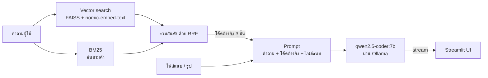

# Local Coding Assistant

ผู้ช่วยเขียนโค้ดแบบแชทที่รันบนเครื่องตัวเองทั้งหมด ตอบคำถามด้วย LLM `qwen2.5-coder:7b` ผ่าน Ollama
และค้นตัวอย่างโค้ดจากชุดข้อมูลมาประกอบคำตอบด้วย Hybrid RAG (Vector search + BM25)


## ลิงก์ส่งงาน

- วิดีโอสาธิต (YouTube ไม่เกิน 5 นาที): [TODO]
- Dataset: https://github.com/66114540676/LLMprompt/tree/project/dataset
- Source code: https://github.com/66114540676/LLMprompt/tree/project

## สถาปัตยกรรม



1. ตอนเปิดแอป ไฟล์ใน `dataset/` ถูกแบ่งเป็นชิ้น (ไฟล์ `.py` แยกทีละฟังก์ชัน/คลาส ไฟล์อื่นทีละ 40 บรรทัด) แล้วสร้างดัชนีทั้งแบบ vector และ BM25
2. เมื่อถาม ระบบค้น 3 ชิ้นที่เกี่ยวข้องที่สุดตามโหมดที่เลือก (Hybrid รวมผลสองวิธีด้วย Reciprocal Rank Fusion)
3. โค้ดที่ค้นได้ ไฟล์แนบ และคำถาม ถูกส่งให้ `qwen2.5-coder:7b` คำตอบ stream กลับมาที่หน้าแชท
4. รูปที่แนบจะให้ `qwen2.5vl:3b` บรรยายเป็นข้อความก่อน แล้วส่งต่อให้โมเดลเขียนโค้ด

## ความต้องการของระบบ

- Python 3.10 ขึ้นไป
- [uv](https://docs.astral.sh/uv/)
- [Ollama](https://ollama.com)
- RAM 16 GB แนะนำ โมเดล 7B ใช้หน่วยความจำประมาณ 5 GB
- GPU ไม่บังคับ แต่ถ้า VRAM น้อยกว่า 6 GB โมเดลบางส่วนจะรันบน CPU และตอบช้าลง

## วิธีติดตั้งและรัน

1. เปิด Ollama (เปิดโปรแกรมจาก Start menu หรือรัน `ollama serve` ในเทอร์มินัลแยก)

2. โหลดโมเดล (ครั้งเดียว)

   ```bash
   ollama pull qwen2.5-coder:7b
   ollama pull nomic-embed-text
   ollama pull qwen2.5vl:3b      # ใช้เฉพาะตอนแนบรูป
   ```

3. ติดตั้ง dependency

   ```bash
   uv sync
   ```

4. รันแอป

   ```bash
   uv run streamlit run lab_13_app.py
   ```

   แอปเปิดที่ http://localhost:8501 คำถามแรกจะช้ากว่าปกติเพราะต้องโหลดโมเดลเข้าหน่วยความจำ

## วิธีใช้งาน

- **ถามคำถาม**: พิมพ์ในช่องด้านล่าง หรือกดคำถามแนะนำในหน้าแรก
- **เลือกโหมดค้นหา**: ที่ sidebar ส่วนตั้งค่า เลือก Hybrid (ค่าเริ่มต้น), Vector หรือ BM25
- **แนบไฟล์หรือรูป**: กดไอคอนคลิปในช่องพิมพ์
  - ไฟล์โค้ด/ข้อความ `.py .txt .md .json .csv .js .ts .html .css .java .c .cpp .sql` และ `.pdf` (เฉพาะ PDF ที่มีข้อความ ไม่ใช่ภาพสแกน) ตัดที่ 6,000 ตัวอักษรต่อไฟล์
  - รูป `.png .jpg .jpeg .webp`
  - ไฟล์แนบใช้กับข้อความที่ส่งไปพร้อมกันเท่านั้น
- **ดูโค้ดอ้างอิง**: กด "ดูโค้ดอ้างอิง" ใต้คำตอบ แต่ละแท็บคือโค้ดหนึ่งชิ้นที่ส่งให้โมเดล ชื่อแท็บบอกไฟล์และฟังก์ชัน ใต้โค้ดบอกโหมดที่ค้นเจอและอันดับ
- **จัดการแชท**: สร้างแชทใหม่ สลับ หรือลบแชทได้ที่ sidebar ประวัติแชทบันทึกใน `chat_sessions.json`
- **สถานะ Ollama**: จุดเขียวใน sidebar แปลว่าเชื่อมต่อได้ จุดแดงแปลว่า Ollama ไม่ได้เปิด

## ตัวอย่างคำถาม

คำถามจาก `dataset/test_questions.json` และผลที่ควรได้ในแท็บโค้ดอ้างอิง

| คำถาม | ผลที่ควรได้ |
|---|---|
| `Show me the retry decorator` | อันดับ 1 เป็น `retry` ทุกโหมด |
| `How can I cache a function's results so repeated calls are fast?` | อันดับ 1 เป็น `memoize` ทั้งที่คำถามไม่มีคำว่า memoize |
| `Example of the observer pattern` | อันดับ 1 เป็น `EventEmitter` |

ลองถามคำถามเดียวกันทั้ง 3 โหมดแล้วเทียบแท็บโค้ดอ้างอิง

## ผลทดสอบ

วัดด้วย `uv run python evaluate_retrieval.py` (คำถาม 15 ข้อ ไม่นับคำถามนอก dataset 2 ข้อ) ผลรายข้ออยู่ใน [dataset/eval_results.md](dataset/eval_results.md)

Hit@3 คือสัดส่วนคำถามที่ผลค้นหา 3 อันดับแรกมีฟังก์ชัน/คลาสที่คาดหวังอย่างน้อยหนึ่งตัว

| โหมด | Hit@3 ภาษาอังกฤษ | Hit@3 ภาษาไทย | รวม |
| --- | --- | --- | --- |
| Vector | 8/8 (100%) | 1/5 (20%) | 9/13 (69%) |
| BM25 | 8/8 (100%) | 0/5 (0%) | 8/13 (62%) |
| Hybrid | 8/8 (100%) | 1/5 (20%) | 9/13 (69%) |

คำถามภาษาอังกฤษค้นเจอครบทุกโหมด รวมถึงคำถามเชิงแนวคิดที่ไม่เอ่ยชื่อฟังก์ชัน ส่วนภาษาไทยยังค้นไม่ได้:
BM25 ตัดคำไทยไม่ได้ และ Vector คืนผลชุดเดิมให้ทุกคำถามภาษาไทย เพราะ `nomic-embed-text` ไม่รองรับภาษาไทย
ข้อที่นับว่าเจอ 1 ข้อเป็นความบังเอิญ

## โครงสร้างไฟล์

```
├── lab_13_app.py               # Streamlit UI
├── lab_12_hybrid_rag.py        # โหลด dataset, แบ่งชิ้น, Hybrid RAG (FAISS, BM25, RRF)
├── lab_13_coding_assistant.py  # prompt และการเรียก qwen2.5-coder ผ่าน Ollama
├── evaluate_retrieval.py       # วัด Hit@3 ของทั้ง 3 โหมด
├── assets/style.css            # สีและรูปแบบของหน้าแอป
├── dataset/
│   ├── sample_code.py          # ฐานความรู้: ตัวอย่างโค้ด 46 ฟังก์ชัน/คลาส
│   ├── test_questions.json     # คำถามทดสอบ 15 ข้อ
│   ├── eval_results.md         # ผลวัดล่าสุด
│   └── README.md               # รายละเอียด dataset และวิธีเพิ่มไฟล์
├── .streamlit/config.toml      # ธีมสีเข้ม
├── pyproject.toml
└── uv.lock
```

สร้างตอนรันแอป (ไม่อยู่ใน git): `chat_sessions.json` และ `chat_uploads/`

## การแก้ปัญหาที่พบบ่อย

| ปัญหา | วิธีแก้ |
|---|---|
| ขึ้น "เรียกโมเดลไม่สำเร็จ" หรือจุดสถานะใน sidebar เป็นสีแดง | เปิด Ollama แล้วรอสักครู่ จุดสถานะเช็กใหม่ทุก 15 วินาที |
| Ollama เปิดอยู่แต่ยังเรียกโมเดลไม่ได้ | ตรวจด้วย `ollama list` ว่ามี `qwen2.5-coder:7b` และ `nomic-embed-text` ถ้าไม่มีให้ `ollama pull` |
| แนบรูปแล้วขึ้นว่าไม่พบโมเดลอ่านรูป | `ollama pull qwen2.5vl:3b` |
| พอร์ต 8501 ถูกใช้อยู่ | `uv run streamlit run lab_13_app.py --server.port 8502` |
| ตอบช้ามาก | ดู `ollama ps` ถ้าช่อง PROCESSOR มี CPU แปลว่า VRAM ไม่พอ ลองเปลี่ยน `LLM_MODEL` ใน `lab_13_coding_assistant.py` เป็น `qwen2.5-coder:3b` |
| เพิ่มไฟล์ใน `dataset/` แล้วค้นไม่เจอ | รีสตาร์ทแอป ดัชนีสร้างครั้งเดียวตอนเปิดแอป |

## ข้อจำกัด

- โมเดลตอบทีละคำถาม ไม่เห็นข้อความก่อนหน้าในแชท จึงถามต่อจากคำตอบเดิมไม่ได้
- ค้นด้วยคำถามภาษาไทยยังไม่ได้ผล (BM25 ตัดคำไทยไม่ได้ และ `nomic-embed-text` ไม่รองรับภาษาไทย) แต่โมเดลยังตอบเป็นภาษาไทยได้
- ความเร็วขึ้นกับฮาร์ดแวร์ การแนบรูปช้ากว่าปกติเพราะต้องรันสองโมเดลต่อกัน
- อ่าน PDF ที่เป็นภาพสแกนไม่ได้
